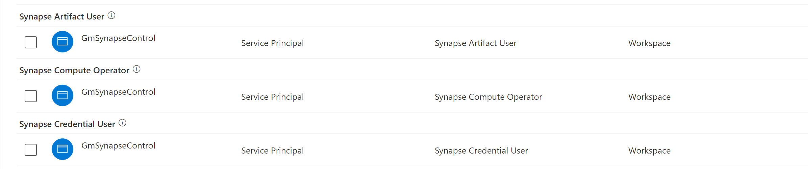

# FlowGate

FlowGate is a state-of-the-art Synapse execution tool that allows you to trigger a Synapse pipeline using a familiar interface: A button!

FlowGate is a Blazor application that uses application settings to determine which Synapse pipeline to trigger. 

# Example

Check out an example by clicking [here](https://flowgate.azurewebsites.net).

## Deployment
Simply click the deploy to Azure button and instantly get this state of the art tool in your own environment! 

## Configuration

| Setting Name | Description |
|--------------|-------------|
| ClientId | The ID of the service principal / application | 
| ClientSecret | The secret of the service principal | 
| TenantId | The ID ot the Azure AD tenant that the service principal / application belongs to | 
| WorkspaceName | The name of the synapse workspace that contains the pipeline | 
| PipelineName | The name of the pipeline that you would like the trigger. |

## Authentication
The web application by default does **not** have Azure AD authentication required. 
To do this, please reference this document: [https://docs.microsoft.com/en-us/azure/app-service/configure-authentication-provider-aad](https://docs.microsoft.com/en-us/azure/app-service/configure-authentication-provider-aad)

## Prerequisites

The FlowGate simply needs a service principal created and Synapse RBAC granted on the workspace you're trying to access. 

### Synapse RBAC
 
Below lists the Synapse RBAC required for the service principal:

